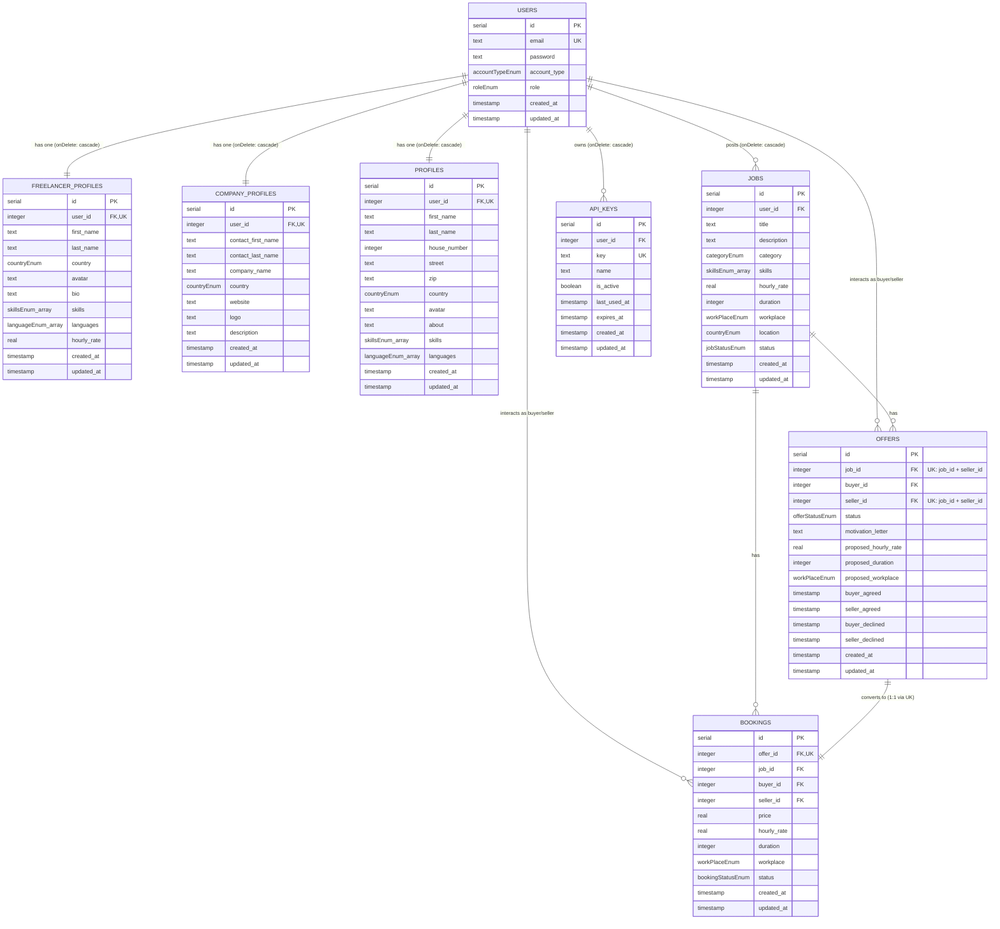

```mermaid
erDiagram
    USERS {
        serial id PK
        text email UK
        text password
        accountTypeEnum account_type
        roleEnum role
        timestamp created_at
        timestamp updated_at
    }

    FREELANCER_PROFILES {
        serial id PK
        integer user_id FK, UK
        text first_name
        text last_name
        countryEnum country
        text avatar
        text bio
        skillsEnum_array skills
        languageEnum_array languages
        real hourly_rate
        timestamp created_at
        timestamp updated_at
    }

    COMPANY_PROFILES {
        serial id PK
        integer user_id FK, UK
        text contact_first_name
        text contact_last_name
        text company_name
        countryEnum country
        text website
        text logo
        text description
        timestamp created_at
        timestamp updated_at
    }

    PROFILES {
        serial id PK
        integer user_id FK, UK
        text first_name
        text last_name
        integer house_number
        text street
        text zip
        countryEnum country
        text avatar
        text about
        skillsEnum_array skills
        languageEnum_array languages
        timestamp created_at
        timestamp updated_at
    }

    JOBS {
        serial id PK
        integer user_id FK
        text title
        text description
        categoryEnum category
        skillsEnum_array skills
        real hourly_rate
        integer duration
        workPlaceEnum workplace
        countryEnum location
        jobStatusEnum status
        timestamp created_at
        timestamp updated_at
    }

    OFFERS {
        serial id PK
        integer job_id FK "UK: job_id + seller_id"
        integer buyer_id FK
        integer seller_id FK "UK: job_id + seller_id"
        offerStatusEnum status
        text motivation_letter
        real proposed_hourly_rate
        integer proposed_duration
        workPlaceEnum proposed_workplace
        timestamp buyer_agreed
        timestamp seller_agreed
        timestamp buyer_declined
        timestamp seller_declined
        timestamp created_at
        timestamp updated_at
    }

    BOOKINGS {
        serial id PK
        integer offer_id FK, UK
        integer job_id FK
        integer buyer_id FK
        integer seller_id FK
        real price
        real hourly_rate
        integer duration
        workPlaceEnum workplace
        bookingStatusEnum status
        timestamp created_at
        timestamp updated_at
    }

    API_KEYS {
        serial id PK
        integer user_id FK
        text key UK
        text name
        boolean is_active
        timestamp last_used_at
        timestamp expires_at
        timestamp created_at
        timestamp updated_at
    }

    USERS ||--|| FREELANCER_PROFILES : "has one (onDelete: cascade)"
    USERS ||--|| COMPANY_PROFILES : "has one (onDelete: cascade)"
    USERS ||--|| PROFILES : "has one (onDelete: cascade)"
    USERS ||--o{ JOBS : "posts (onDelete: cascade)"
    USERS ||--o{ OFFERS : "interacts as buyer/seller"
    USERS ||--o{ BOOKINGS : "interacts as buyer/seller"
    USERS ||--o{ API_KEYS : "owns (onDelete: cascade)"
    JOBS ||--o{ OFFERS : "has"
    JOBS ||--o{ BOOKINGS : "has"
    OFFERS ||--|| BOOKINGS : "converts to (1:1 via UK)"
```
